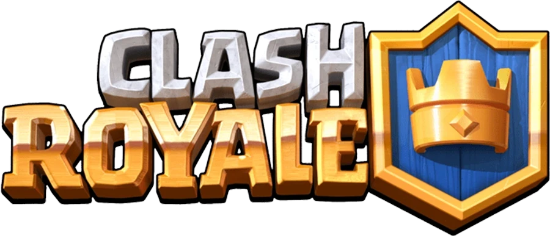

<div align="left">
  
  
</div>

# Clash Royale Database Project

## Overview
This project is an academic database modeling assignment focused on designing a relational database for the mobile game **Clash Royale**. It is built using **SQLite** and structured to manage game entities such as Players, Clans, Arenas, Battles, Cards, and more. 

The primary goal is to apply database design concepts, enforce relationships (Primary/Foreign Keys), ensure data integrity through constraints (e.g., `CHECK`, `ON DELETE CASCADE`), and correctly map the game's mechanics into a SQL schema.

## Technologies Used
- **SQL / SQLite**: Used for creating the database schema, setting up tables, constraints, and populating data.

## Project Structure
The repository is structured as follows:

- **`tables/`**
  - Contains SQL scripts to define the database schema.
  - `create1.sql`: Initial version of the database schema defining tables and constraints.
  - `create2.sql`: An improved version utilizing more robust SQLite types (e.g., `INTEGER`, `TEXT`) and enforcing referential integrity with `ON DELETE CASCADE`.

- **`population/`**
  - Contains SQL scripts with `INSERT` statements to populate the database with initial dummy data.
  - `populate1.sql`: Data insertion script.
  - `populate2.sql`: Extended data insertion script.

- **`Clash.db`**
  - The compiled SQLite database file containing all the schemas and populated data.

- **`Relatório_LEIC012_0802.pdf`**
  - The project report detailing the database design decisions, Entity-Relationship (ER) modeling, and project specifications.

## Database Schema (Key Entities)

The schema contains 24 interconnected tables reflecting Clash Royale's core components:

1. **Player & Clan System**: `Player`, `Clan`, `PlayerClan`
2. **Game Items & Currency**: `Item`, `Card`, `Gold`, `Gem`
3. **Shop & Transactions**: `Shop`, `Price`
4. **Cards & Decks**: `CardStats`, `Deck`, `CardDeck`, `PlayerCardLevel`
5. **Progression & Trophies**: `Arena`, `PlayerArena`
6. **Chests**: `ChestType`, `ChestInstance`, `PlayerChest`, `ItemChest`
7. **Matches & Competitions**: `Battle`, `Result`, `Tournament`, `Stats`

## How to Run

1. Ensure you have [SQLite](https://www.sqlite.org/download.html) installed on your system.
2. You can interact with the existing database by opening the terminal and running:
   ```bash
   sqlite3 Clash.db
   ```
3. To recreate the database from scratch, run the schema and population scripts:
   ```bash
   sqlite3 Clash.db < tables/create2.sql
   sqlite3 Clash.db < population/populate2.sql
   ```

## License
This project was created for educational purposes.
